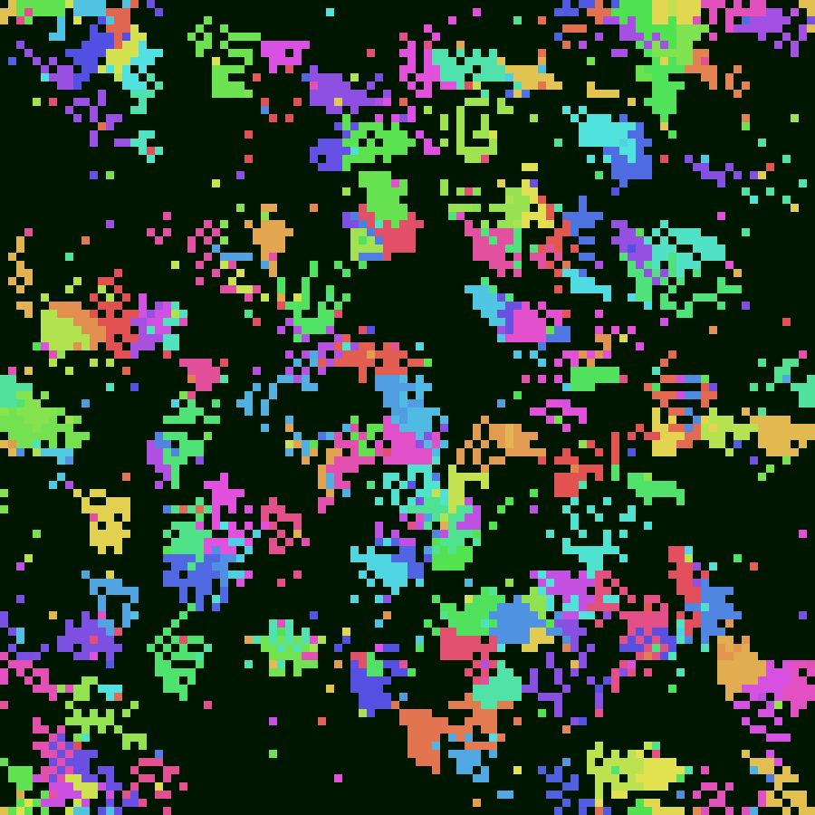
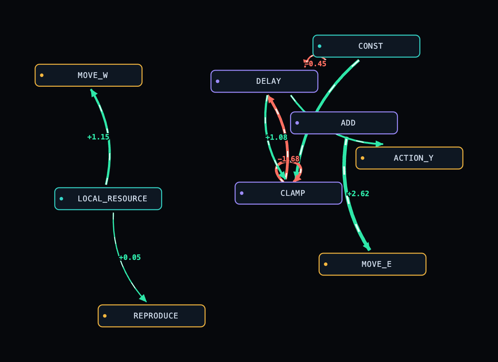

# Simolution

> **Artificial life under honest thermodynamics.** The kernel defines physical laws — energy, decay, diffusion, signal propagation — and *never* meanings, goals, or fitness. Lifelike strategies must **evolve**; they are never coded in.

<p align="center">
  
</p>

<p align="center"><sub>A 100×100 toroidal world mid-run — <b>3,143 units, 457 distinct genomes</b>, each colour one lineage clustering into territory. Nothing tells a cell where to go; the patches are emergent.</sub></p>

Simolution is a small, deterministic virtual machine for *evolving* signal-graph organisms on a 2D toroidal grid. Each organism is a genome — a list of 32-bit genes, each gene one weighted wire between nodes of a fixed substrate. The kernel ticks physics forward; mutation rewires the genomes; survival does the rest.

The defining rule is what the kernel **refuses** to do:

> **No semantics in the kernel.** Nodes carry no meaning. The kernel never interprets, rewards, or privileges a behaviour. There is no fitness function, no objective, no "good move." A cell that senses food and moves toward it does so only because that wiring out-survived the wiring that didn't. If a behaviour looks purposeful, it *emerged* — that is the entire experiment.

Everything a unit can do — eat, grow, hoard, move, reproduce — is an effector its genome may or may not drive. Whether it *should* is never answered by the code, only by the grave.

## A genome, decoded

Here is one organism's evolved circuit, drawn by the built-in viewer (junk wiring hidden):

<p align="center">
  
</p>

Signal flows left → right: **teal sensors → purple logic nodes → gold effectors**, with green/red edges for excitatory/inhibitory weights. Read what evolution wired here:

- **`LOCAL_RESOURCE → MOVE_W` (+1.15)** and **`LOCAL_RESOURCE → REPRODUCE` (+0.05)** — an emergent sense-and-respond reflex: the food sensor *directly* drives movement and breeding. Nobody wrote "move toward food." Selection did.
- **`DELAY ↔ CLAMP` (+1.08 / −1.68)** — a feedback loop through the one-tick memory node: a tiny evolved oscillator/integrator.
- Most of the 32 genes are **junk** — silent wiring carrying no signal. Hidden here, it is the raw material the next mutation might switch on.

## How it works

**Substrate.** Every unit shares the same fixed node layout (`NodeLayout.TOTAL = 24`):

| Sensors | Internals | Actions |
|---|---|---|
| `CONST`, `RAND`, `LOCAL_RESOURCE`, `SELF_ENERGY`, `SELF_MASS` | `ADD`, `MUL`, `CLAMP`, `DELAY`, `THRESH` | `ACTION_Y`, `HARVEST`, `REPRODUCE`, `MOVE_N/S/E/W`, `GROW` |

A genome is just which nodes are wired to which, and how strongly.

**Gene encoding (32 bits).** `[SrcType:1 | SrcID:7 | DstType:1 | DstID:7 | Weight:16]`. IDs wrap modulo the node count and the weight is a linear signed scale, so **every random 32-bit integer is a legal gene** — mutation can never produce an un-decodable genome.

**The tick** is a locked 11-phase pipeline, the same every step, with no per-tick allocation and memory only through `DELAY` (no instantaneous feedback):

```
clear → propagate → evaluate → swap
      → intake → cost → growth → reproduction → movement → diffusion → decay
```

**Energy is conserved.** It is never created, only moved — into a cell from inflow, into a unit by harvesting, out to a sink by metabolism, growth loss, motility, and death. An audit invariant (`energy-audit-error ≈ 0`) holds every tick.

**Biomass & size.** A unit has a heritable `mass` (crystallized energy). Maintenance scales with mass, harvest scales with `mass^α` (a surface-area law), and a heavier body moves at higher cost — so growth is a real, evolvable trade-off. Reproduction is **symmetric binary fission**: mass and energy split 50/50, with no viability gate — the size-control checkpoint has to *emerge* via the `SELF_MASS` sensor.

**Space & motility.** The W×W grid *is* the population: one unit per cell. Each cell holds its own resource field, replenished by inflow (uniform, or a programmable pulsing/orbiting/noise field), spread by diffusion, and dissipated by decay so nothing stays free forever. Units sense only their own cell and take one Moore step per tick — **chemotaxis is emergent**, never coded.

**Evolution.** At each birth the child genome is copied with per-bit point mutation, then per-gene deletion and tandem duplication — so genome *length itself is heritable*. Duplicating a harvest transporter raises intake capacity (gene dosage); replication costs energy that scales with the child's length.

## Quickstart

Requires **JDK 25** (`.sdkmanrc` pins `25.0.1-oracle`).

```sh
./gradlew run     # demo: a 4-gene feedback genome, 10 ticks, trace + report
./gradlew test    # JUnit 5 + spec-conformance tests against an independent reference model
./gradlew build   # full verification

# a real population run — byte-deterministic report + sidecars
./gradlew run --args="--units 100 --ticks 1000 --seed 42 --world 100 --out runs/run.txt"
```

Useful flags: `--units N --ticks T --seed S --world W --genes G --max-genes G2`, plus a patchy, breathing resource world: `--resource-cycle --cycle-period 2000 --cycle-radius 22 --cycle-peak 10` (or the full `--inflow "<dsl>"`).

## Watch a run

Every `--out` run streams a compact spatial history (`.frames.zst` + genome `.catalog.gz`). Explore it in the browser:

```sh
# bake a self-contained, offline viewer (opens anywhere, even file://)
python3 tools/mapviz.py runs/run.frames.zst    # -> runs/run.map.html

# or follow a run LIVE while it ticks
bash scripts/serve-live.sh                      # serves runs/ on :8090
```

The viewer is what produced the images above: scrub the lattice (colour by genome), click any cell to inspect its **evolved circuit** as a force-directed graph, and walk a lineage's genome diffs over its `.births.csv.gz` (DuckDB-queryable). A deterministic-replay observability layer (`--observe`) adds checkpoints + time-travel.

## Determinism — the prime invariant

Same genome + same seed → **byte-identical history, always.** Fixed seed, no wall-clock, no unseeded randomness, fixed evaluation order, and a counter-based RNG that is a pure function of `(seed, unit, tick)`. The signal state is single-precision `float` (the energy economy stays `double` so conservation is exact); strict IEEE-754 keeps it reproducible — verified byte-identical run-to-run *and* across JDK 25 ↔ 26.

## Milestones

The kernel grew one honest law at a time, each on its own branch:

| | |
|---|---|
| **v0.1** | multi-unit signal-graph VM, energy accounting (decay, activity cost, death) |
| **v1** | energy intake — depletable resource + emergent harvest capacity |
| **v2** | reproduction + point mutation + entropic aging (evolution proper) |
| **v3** | space + motility — toroidal lattice, per-cell resource, `MOVE` effectors |
| **v4** | variable-length genomes — heritable gene count via indels |
| **v5** | biomass — `mass` as crystallized energy, growth, symmetric fission |

Next: crowding/quorum signalling and multi-resource stoichiometry. Each decision is recorded in a short ADR under [`docs/decisions/`](docs/decisions/), and the binding physical laws live in [`docs/contract/`](docs/contract/).

## Lineage & credit

Simolution owes its gene-as-wiring representation to **David Miller's [biosim4](https://github.com/davidrmiller/biosim4)** — the project that proved you could *watch* a population get better at a thing across generations. Simolution forks the philosophy: where biosim4 scores survival against a chosen challenge, Simolution removes the scorer entirely and lets thermodynamics be the only judge. (See [`docs/story/biosim4-tribute.md`](docs/story/biosim4-tribute.md).)

## Docs

[`AGENTS.md`](AGENTS.md) is the deep guide — architecture, invariants, the performance doctrine, and the full spec index. If code and a binding spec ever disagree, the spec wins.
